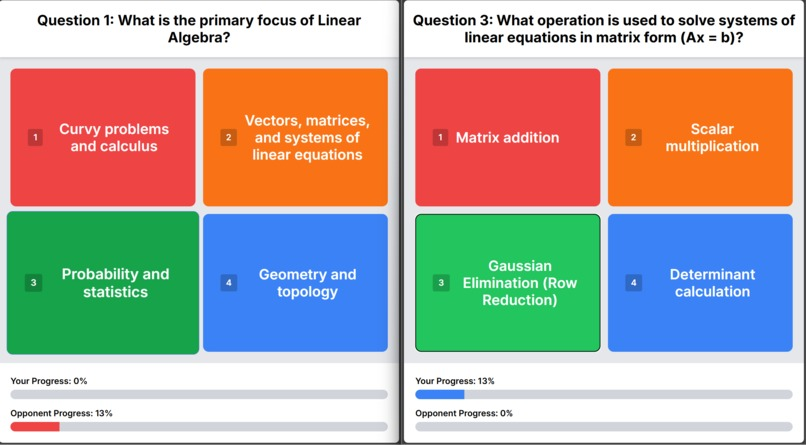

# Quiz Race

Upload a document and instantly turn it into a multiplayer quiz: generate questions with an LLM, host a lobby, race to answer, and see results.


<!-- Add a screenshot above (drop a screenshot.png in this folder) -->

**Devpost:** [quiz-race](https://devpost.com/software/quiz-race-ad4ewk)

## Tech Stack

- React 19, Vite, Tailwind CSS, React Router
- Firebase (auth + data — no separate backend)
- OpenRouter API for quiz generation, `mammoth` for document parsing

## Running Locally

```bash
npm install
npm run dev
```
